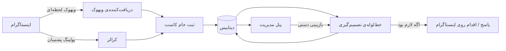
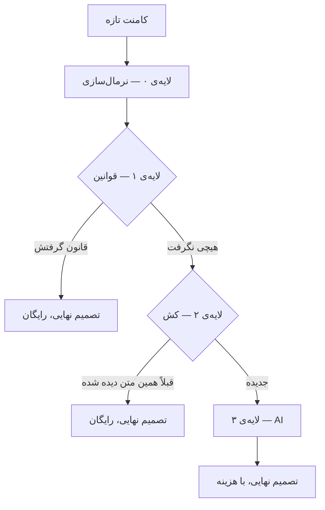
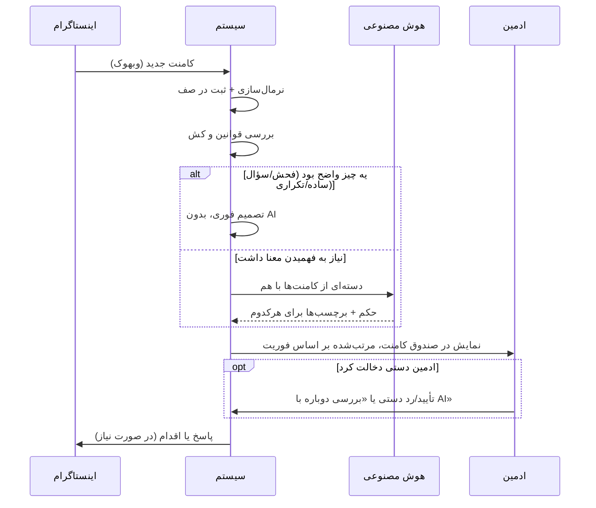
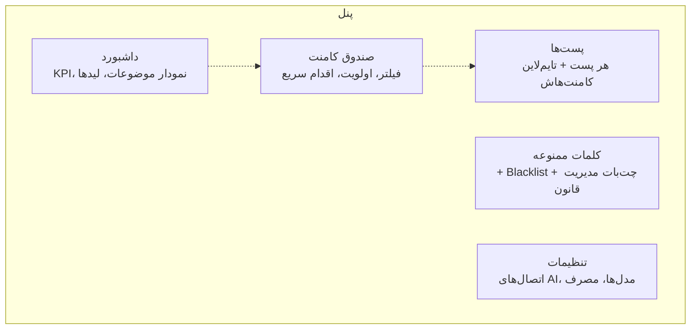

# CommentOS — طرز کار سیستم

---

## ۱. صورت مسئله

یه پیج اینستاگرام فعال روزی چند صد کامنت می‌گیره و این کامنت‌ها اصلاً هم‌ارزش نیستن. یکی سؤال قیمت پرسیده و عملاً یه سرنخ فروشه، یکی شکایت کرده و اگه جوابش دیر بشه دردسر درست می‌کنه، یکی فحش داده، و یکی هم فقط یه اموجی گذاشته. خوندن دستی این حجم شدنی نیست، و ضرر اصلی هم همین‌جاست: کامنت‌هایی که پول یا آبرو پشتشونه، لای بقیه گم می‌شن.

CommentOS دقیقاً همین وسط می‌ایسته. هر کامنتی که می‌رسه خونده و برچسب‌گذاری می‌شه — احساس، نیت، موضوع، احتمال خرید — بعد اولویت می‌گیره و اگه لازم باشه همون‌جا براش اقدام انجام می‌شه.

چیزی که این سیستم رو از یه «هرچی اومد بده به AI» جدا می‌کنه، جای دخالت هوش مصنوعیه. مدل فقط جایی وارد می‌شه که واقعاً به فهمیدن معنا نیاز باشه؛ کامنت تکراری یا کاملاً واضح اصلاً به AI نمی‌رسه.

---

## ۲. نمای کلی

ورودی دو تا مسیر داره: وبهوک که مسیر اصلی و لحظه‌ایه، و پولینگ که هر ۵ دقیقه یه بار اجرا می‌شه تا هر چیزی که وبهوک از دست داده جا نمونه. هر دو مسیر کامنت خام رو توی یه صف ساده روی دیتابیس می‌ریزن، و یه پردازشگر پس‌زمینه هر ۱۰ ثانیه سراغ صف می‌ره و خالیش می‌کنه. یعنی دریافت کامنت و تصمیم‌گیری درباره‌ش از هم جدا شدن و کند شدن یکی، اون یکی رو زمین نمی‌زنه.

---

## ۳. خط‌لوله‌ی تصمیم‌گیری

مهم‌ترین بخش سیستم همینه. هر کامنت از چهار لایه رد می‌شه، ولی قرار نیست همه‌ی لایه‌ها اجرا بشن؛ هر لایه که تونست تصمیم بگیره، کار همون‌جا تموم می‌شه.

**لایه‌ی صفر، نرمال‌سازی.** فاصله‌های اضافه، حروف عربی به‌جای فارسی، اموجی، لینک و حروف کشیده («سلاااام») همه یکدست می‌شن. این لایه خودش تصمیمی نمی‌گیره، ولی دقت هر سه لایه‌ی بعدی به کیفیت کارش وابسته‌ست.

**لایه‌ی یک، قوانین.** آنی و بدون هزینه. اگه نویسنده صاحب پیج یا توی لیست مجازها باشه، کامنت تأیید می‌شه. اگه توی Blacklist باشه — یعنی قبلاً فحش داده — حذف می‌شه، بدون اینکه اصلاً محتوای کامنت خونده بشه. بعدش نوبت کلمات ممنوعه‌ی دیتابیسه که از پنل قابل مدیریته، و چند تا هیوریستیک ساده: شماره موبایل، لینک تلگرام و واتساپ، درخواست پیوی، تعداد زیاد لینک یا منشن. کامنت‌های خیلی کوتاه یا فقط-اموجی هم همین‌جا تأیید خودکار می‌شن. حدود یک‌سوم کل کامنت‌ها از همین لایه بیرون می‌رن، با صفر توکن.

**لایه‌ی دو، کش.** اگه دقیقاً همین متن — بعد از نرمال‌سازی — قبلاً یه بار به AI رفته باشه، همون جواب قبلی برمی‌گرده. «واقعا عالیه» و «قیمت؟» و شبیه‌شون اون‌قدر تکرار می‌شن که این لایه به‌تنهایی صرفه‌جویی محسوسی داره.

**لایه‌ی سه، AI.** فقط چیزی به اینجا می‌رسه که سه لایه‌ی قبل نتونستن درباره‌ش تصمیم بگیرن، اون‌هم نه دونه‌دونه: تا ۳۰ کامنت با هم توی یه درخواست دسته‌ای فرستاده می‌شن. خروجی هم به‌جای JSON، یه فرمت فشرده‌ی یک‌خط به‌ازای هر کامنته تا توکن خروجی هم کم بمونه.

چیزی که مدل برای هر کامنت برمی‌گردونه: حکم (نگه‌دار / حذف / بررسی دستی)، احساس، نیت (سؤال، خرید، شکایت، تعریف و…)، موضوع، و امتیاز سرنخ خرید از ۰ تا ۱۰۰.

یه قاعده‌ی سفت‌وسخت هم اینجا هست: اگه جواب مدل بدفرمت باشه یا وسط کار قطع بشه، هیچ حدسی زده نمی‌شه. اون کامنت مستقیم می‌ره توی صف بررسی دستی. هیچ کامنتی به‌خاطر خروجی نامعتبر حذف نمی‌شه.

---

## ۴. مسیر یک کامنت، از اول تا آخر

نکته‌ی این نمودار اینه که ادمین از خط‌لوله بیرون نیست. تصمیم سیستم نقطه‌ی پایان نیست؛ هر کامنت توی پنل قابل بازبینیه و دست آدم همیشه بالاتره.

---

## ۵. چیزی که ادمین می‌بینه

داشبورد همه‌ی عددهاش رو مستقیم از دیتابیس می‌گیره، نه از AI: چند کامنت پردازش شده، چند تاش لید خرید بوده، نسبت مثبت و خنثی و منفی چقدره، چند مورد بحرانی داشته و پرتکرارترین موضوع‌ها چی بودن.

صندوق کامنت لیست زنده‌ی کامنت‌هاست و پیش‌فرض بر اساس فوریت مرتب می‌شه؛ شکایت و سرنخ خرید میان بالا، اسپم می‌ره ته صف. هر کامنت برچسب‌هاش رو کنار خودش داره، دستی قابل تأیید یا رد کردنه، و یه دکمه‌ی «بررسی با AI» هم داره که کامنت رو از اول می‌فرسته توی خط‌لوله.

بخش پست‌ها کامنت‌های هر پست رو کنار هم نشون می‌ده، به‌علاوه‌ی یه خلاصه‌ی یک‌خطی که فقط با درخواست خود ادمین ساخته می‌شه — نه خودکار، تا هزینه‌ی بی‌دلیل ایجاد نشه.

بخش کلمات ممنوعه سه چیزه کنار هم: لیست قوانین دستی، Blacklist که خودش پر می‌شه (هر کی فحش بده دفعه‌ی بعد بدون AI رد می‌شه)، و یه چت‌باکس که می‌شه باهاش حرف زد — «فلان کلمه رو هم اضافه کن» — و خودش قانون رو می‌سازه.

توی تنظیمات هم هر سرویس هوش مصنوعی سازگار با OpenAI یا Anthropic قابل اتصاله، می‌شه چند مدل مختلف تعریف کرد و برای هر پیج مدل جدا انتخاب کرد. مصرف توکن هم همین‌جا قابل رصده.

---

## ۶. دو تا عدد که موقع دمو به کار میان

حدود **۳۴٪** کامنت‌ها کاملاً رایگان و با قانون تعیین‌تکلیف می‌شن. بقیه به AI می‌رن، ولی دسته‌ای و با خروجی فشرده، که میانگین رو می‌رسونه به حدود **۱۸ توکن به‌ازای هر کامنت**. یعنی هزینه‌ی هزار تا کامنت در حد چند صفحه متنه، نه چیزی که لازم باشه نگرانش بود.

و حرف آخر که بیشتر از عددها می‌ارزه: هیچ‌وقت چیزی با حدس حذف نمی‌شه. هر جا که سیستم مطمئن نیست، تصمیم رو می‌ذاره برای چشم آدم.
