# برنامه‌ی وبینار — ۲ ساعت

این یه رانداون اجرایی‌ه، نه متن سخنرانی. هر بخش یه هدف و چندتا نکته‌ی کلیدی داره که باید بهش برسی، خودت با زبون خودت پرش کن. زمان‌ها تقریبیه، ولی سعی کن ازشون زیاد عقب نیفتی چون بخش پول‌درآوردن آخر وبیناره و معمولاً همونیه که مردم منتظرشن.

---

## ساختار کلی (نقشه‌ی راه ۲ ساعت)

```mermaid
gantt
    dateFormat HH:mm
    axisFormat %H:%M
    section وبینار
    خوش‌آمد و چرا اینجاییم        :00:00, 10m
    از ایده تا محصول (استوری)      :00:10, 20m
    دموی زنده‌ی سیستم              :00:30, 20m
    استراحت کوتاه                  :00:50, 10m
    کدنویسی با AI (پشت‌صحنه)       :01:00, 25m
    مارکتینگ یه محصول مثل این      :01:25, 20m
    پول درآوردن ازش                :01:45, 25m
    جمع‌بندی و پرسش‌وپاسخ          :02:10, 10m
```

---

## ۱. خوش‌آمد و چرا اینجاییم (۰۰:۰۰ – ۰۰:۱۰)

هدف: مردم رو نگه‌دار، بهشون بگو امشب دقیقاً چی گیرشون میاد.

- خودتو معرفی کن، ولی سریع — کسی نیومده بایوی تو رو بشنوه.
- یه جمله بگو که کل وبینار رو خلاصه کنه: «امشب یه محصول واقعی رو از صفر جلوی چشمتون ساختم، نشونتون می‌دم چطور کار می‌کنه، چطور با AI ساختمش، و چطور می‌شه ازش پول درآورد.»
- بگو امشب قراره چی *نبینن*: این یه دوره‌ی آموزش برنامه‌نویسی نیست. تمرکز رو روی فرآیند و تصمیم‌ها بذار، نه سینتکس.
- یه چیز کوچیک بذار که بعداً بهش برگردی («یه باگ بود که کل هوش مصنوعی سیستم رو ۲۴ ساعت خاموش نگه داشته بود و خودم متوجه نشده بودم — بعداً براتون تعریف می‌کنم») — این کار مردم رو نگه می‌داره تا آخر.

---

## ۲. از ایده تا محصول — استوری واقعی (۰۰:۱۰ – ۰۰:۳۰)

هدف: نشون بدی محصول واقعی از یه مسئله‌ی واقعی میاد بیرون، نه از یه لیست فیچر.

نقاط داستان (به ترتیب زمانی واقعی خودت تعریف کن):

1. **شروع اولیه:** یه ابزار ساده برای حذف خودکار کامنت اینستاگرام — مسئله‌ی مشخص، راه‌حل مشخص.
2. **دیوار:** فهمیدی BoxAPI اصلاً API حذف کامنت نداره. کل فرض اولیه‌ی محصول از پایه غلط بود.
3. **تصمیم سخت:** به‌جای رها کردن یا صبر کردن، محصول رو بازتعریف کردی — از «ابزار حذف کامنت» به «سیستم هوش کامنت» (CommentOS). حذف فقط یه تیکه از یه چیز بزرگ‌تر شد، نه کل محصول.
4. **قید زمانی واقعی:** فعال‌سازی API رسمی BoxAPI چند روز طول می‌کشید، پس اول از همه دیپلوی کردی تا اون ساعت‌شمار شروع بشه، بعد موازی باهاش بقیه‌ی سیستم رو ساختی.
5. **کشف میدونی:** حتی مستندات BoxAPI هم اشتباه/ناقص بود — دامنه‌ی API رسمی اصلاً چیزی نبود که مستندات می‌گفت، خودت با تست مستقیم فهمیدیش.

نکته‌ی مهم برای این بخش: تأکید کن که **پیوت کردن وسط راه، شکست نیست — عادیه.** اکثر محصولات واقعی همینطوری ساخته می‌شن.

---

## ۳. دموی زنده‌ی سیستم (۰۰:۳۰ – ۰۰:۵۰)

هدف: نشون بدی این یه پروژه‌ی نصفه‌کاره نیست، واقعاً کار می‌کنه.

از فایل دیاگرام (`CommentOS-راهنمای-فنی.md`) به‌عنوان نقشه استفاده کن، ولی وقتشو زیاد روی دیاگرام تئوری نذار — بیشتر وقت رو بده به پنل زنده:

- یه کامنت واقعی بفرست (یا از قبل آماده کن) و نشون بده چطور توی صندوق کامنت ظاهر می‌شه، با برچسب‌هاش (احساس/نیت/موضوع/سرنخ خرید).
- داشبورد رو باز کن — روی این تأکید کن که همه‌ی عددها از SQL میان، نه از حدس AI.
- یه کامنت با فحش نشون بده که چطور خودکار حذف می‌شه و نویسنده‌اش می‌ره تو Blacklist.
- صفحه‌ی پست‌ها رو نشون بده — تایم‌لاین کامنت‌های یه پست.
- اگه وقت بود، چت‌باکس مدیریت قوانین رو زنده امتحان کن («این کلمه رو هم ممنوع کن») — این معمولاً بیشترین «وای» رو از مخاطب می‌گیره.

---

## استراحت کوتاه (۰۰:۵۰ – ۰۱:۰۰)

ده دقیقه واقعی بده، نه پنج دقیقه. مردم بعد از استراحت واقعی بیشتر گوش می‌دن.

---

## ۴. کدنویسی با AI — پشت‌صحنه‌ی واقعی (۰۱:۰۰ – ۰۱:۲۵)

هدف: این قسمتیه که مردم واقعاً براش اومدن. صادق باش، هم موفقیت‌ها هم گندکاری‌ها رو بگو.

- توضیح بده از چه ابزاری استفاده کردی و چرا (Claude Code) — نه تبلیغ، فقط واقعیت کارت.
- فلسفه‌ی مهندسی که رعایت کردی رو بگو: «SQL می‌شمارد، AI روایت می‌کند» — یعنی هرجا می‌شد با یه کوئری ساده جواب گرفت، به AI پول ندادی. این دقیقاً همون چیزیه که خیلی از پروژه‌های AI-heavy رعایتش نمی‌کنن و هزینه‌شون می‌ترکه.
- **داستان باگ‌های واقعی رو تعریف کن — این طلاست:**
  - یه فرم که یه فیلد نداشت باعث شد بودجه‌ی روزانه‌ی توکن صفر بشه و هوش مصنوعی ۲۴ ساعت هیچ کامنتی رو بررسی نکنه، بدون هیچ خطای واضحی.
  - یه هدر Authorization اشتباه که یه پیام خطای گمراه‌کننده می‌داد و ساعت‌ها طول کشید بفهمی مشکل از کجاست.
  - دو تا API با اسم مشابه ولی روی دو تا دامنه‌ی کاملاً متفاوت که مستندات هم درست توضیحش نداده بود.
- نتیجه‌گیری این بخش: AI کدنویسی رو سریع‌تر می‌کنه، ولی مسئولیت درست‌بودنش هنوز با توئه. تست کردن، خوندن لاگ، و پرسیدن سؤال درست مهم‌تر از قبل شده، نه کمتر.

---

## ۵. مارکتینگ یه محصول مثل این (۰۱:۲۵ – ۰۱:۴۵)

هدف: از حالت مهندسی خارج شو، برو تو ذهن مشتری.

- **مشتری واقعی کیه؟** صاحب فروشگاه اینستاگرامی که روزی صدها کامنت می‌گیره و وقت نداره بخونتشون. نه یه «شرکت بزرگ»، یه آدم واقعی با یه پیج واقعی.
- **درد واقعی چیه؟** از دست دادن لید خرید وسط انبوه کامنت‌های الکی، دیر جواب‌دادن به شکایت، ندیدن فحش/کامنت مسموم زیر پست.
- **چطور معرفیش کنی:** به‌جای حرف زدن از «هوش مصنوعی» و «تحلیل احساسات»، حرف بزن از نتیجه: «دیگه لید خریدتون گم نمی‌شه» و «صبح که بیدار می‌شی می‌دونی کدوم کامنت‌ها مهمن.»
- **ساخت در ملأ عام (build in public):** همین وبینار خودش مارکتینگه. نشون‌دادن فرآیند واقعی ساخت محصول، اعتماد می‌سازه بیشتر از هر تبلیغ.
- **کانال‌های واقعی برای این بازار:** پیج اینستاگرام خود محصول، گروه‌های تلگرامی صاحبان فروشگاه اینستاگرامی، دمو زنده برای چند تا فروشگاه اول به‌صورت رایگان در ازای فیدبک و نمونه‌کار.

---

## ۶. پول درآوردن از چیزی که ساختی (۰۱:۴۵ – ۰۲:۱۰)

هدف: این بخشیه که تبدیلش می‌کنه به اقدام. مشخص و عملی حرف بزن، نه کلی.

مدل‌های واقعی درآمد برای این نوع محصول:

1. **اشتراک ماهانه (SaaS):** چند سطح قیمتی بر اساس تعداد پیج/تعداد کامنت در ماه. ساده‌ترین و پایدارترین مسیر.
2. **فروش مستقیم به فروشگاه‌های خاص:** به‌جای منتظرماندن برای مشتری، مستقیم برو سراغ ۲۰-۳۰ تا پیج فروشگاهی که می‌شناسی، دمو بده، بفروش. سریع‌ترین راه برای اولین درآمد و فیدبک واقعی.
3. **مدل فریمیوم:** نسخه‌ی پایه رایگان (مثلاً فقط تشخیص و برچسب‌گذاری)، ویژگی‌های پیشرفته (پاسخ خودکار، تحلیل رقبا، Blacklist خودکار) پولی.
4. **فروش به‌عنوان سرویس مدیریت‌شده:** برای فروشگاه‌های بزرگ‌تر که خودشون وقت تنظیم ندارن، خودت به‌عنوان یه سرویس کامل (setup + مدیریت) قیمت بذار، نه فقط دسترسی به نرم‌افزار.
5. **آموزش/محتوا:** همین مسیر ساختن محصول (پیوت، دیباگ، تصمیم‌های فنی) خودش می‌تونه یه دوره یا محتوای پولی بشه برای کسایی که می‌خوان همین مسیر رو برن.

نکات عملی که حتماً بگو:
- شروع کوچیک: اول با چند مشتری واقعی (حتی رایگان)، بعد قیمت‌گذاری.
- هزینه‌ی AI رو همیشه حساب کن — همون فلسفه‌ی «SQL می‌شمارد» که تو بخش کدنویسی گفتی، مستقیم روی حاشیه‌ی سود این محصول اثر می‌ذاره. این ارتباط رو به مخاطب نشون بده — یعنی تصمیم فنی که گرفتی، مستقیم روی سودآوری محصول اثر گذاشته.
- روی یه بازار مشخص (فروشگاه‌های اینستاگرامی ایرانی) بمون قبل از گسترش — تخصصی‌بودن اول اعتماد می‌سازه.

---

## ۷. جمع‌بندی و پرسش‌وپاسخ (۰۲:۱۰ – ۰۲:۲۰)

- یه خلاصه‌ی یک‌دقیقه‌ای از کل مسیر: ایده → دیوار → پیوت → ساخت با AI → محصول واقعی → مسیر پول درآوردن.
- یه call-to-action مشخص بذار (نه کلی): مثلاً «اگه فروشگاه اینستاگرامی دارید و می‌خواید امتحانش کنید، بهم پیام بدید» یا لینک ثبت‌نام.
- وقت بذار برای سؤال‌های واقعی — این معمولاً بهترین بخش برای کسایی‌ه که تا آخر موندن.

---

## یادداشت‌های اجرایی (برای خودت، نه برای مخاطب)

- اگه یه بخش داشت طولانی می‌شد، اول از بخش «دموی زنده» کم کن، نه از بخش پول‌درآوردن — آخری همونیه که نگهشون می‌داره.
- برای بخش باگ‌ها، دقیق و با جزئیات فنی حرف نزن مگر ازت بپرسن — فقط داستان و درسش رو بگو، وگرنه ریتم وبینار می‌افته.
- یه تایمر جلوی خودت بذار، جدی.
